```{r setup, include=FALSE}
knitr::opts_chunk$set(echo = TRUE)
```

Taller 2: Diseño de Primers

**Especies seleccionadas:** *Moniliophthora roreri* y *Moniliophthora perniciosa*.

## 1. Secuencias de las especies seleccionadas

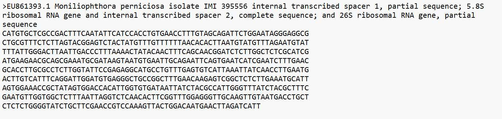{width="531"}

{width="524"}

## **2. Alineamiento**

2.  Creé una carpeta en apolo taller2, donde en un archivo de texto cargué pegué las dos secuencias, y creé un slurm donde coloqué los siguientes códigos:

    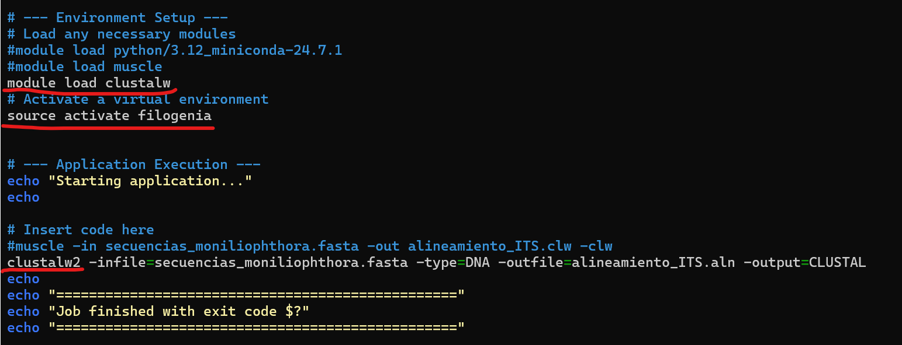{width="543"}

    ### **Resultados**

    **Imagen 1**

    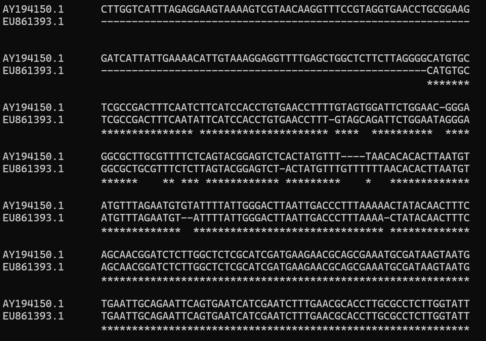{width="508"}

    Dos últimas secuencias conservadas en ambas especies.

    **Imagen 2**

    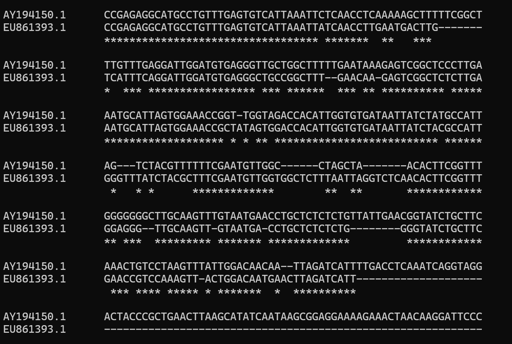{width="503"}

    **Imagen 3**

    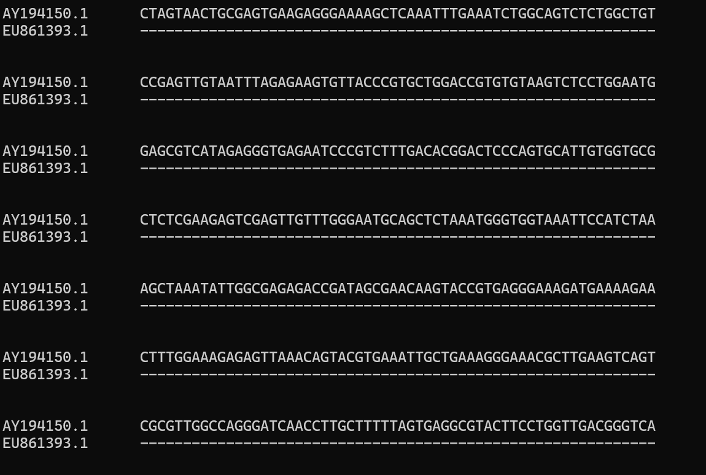{width="501"}

    **Imagen 4**

    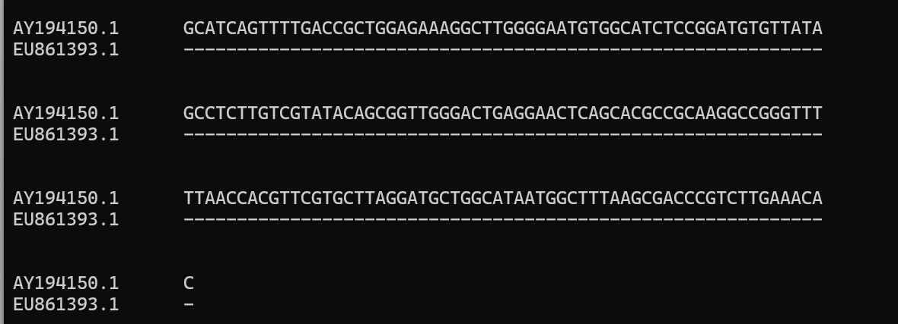{width="506"}

-   **Asteriscos (`*`):** Indican que en esa posición, ambas especies tienen exactamente el mismo nucleótido. Cuando hay una fila larga de asteriscos, es una **región conservada.**

-   **Espacios en blanco (sin asterisco):** Indican que hay un *mismatch* o mutación puntual (por ejemplo, una especie tiene una 'A' y la otra una 'G').

-   **Guiones (`-`):** Indican un **Indel** (inserción o deleción). Significa que a una secuencia le faltan letras que la otra sí tiene. Estas zonas (junto con los espacios en blanco) conforman las **regiones variables**.

***Interpretación:***

Se identificaron regiones altamente conservadas compartidas por ambas especies(Imagen1), evidenciadas por la alineación perfecta (asteriscos continuos). Un ejemplo claro se observa en la secuencia `AGCAACGGATCTCTTGGCTCTCGCATCGATGAAGAACGCAGCGAAATGCGATAAGTAATG`, la cual es ideal para el anillamiento (anclaje) de los primers universales para el género *Moniliophthora.*

Se identificaron regiones altamente variables caracterizadas por polimorfismos de un solo nucleótido (SNPs) y, más importante aún, por eventos de inserción/deleción (indeles). Por ejemplo, en una de las regiones variables se observa que *M. perniciosa* presenta varios nucleótidos adicionales que están ausentes (gaps) en *M. roreri.* Esta variabilidad es clave para diseñar primers que generen amplicones de diferente tamaño, permitiendo la distinción de las especies.

## 3. Diseño de primers

Se utilizó la herramienta **PrimerBlast:**

***Moniliophthora roreri***

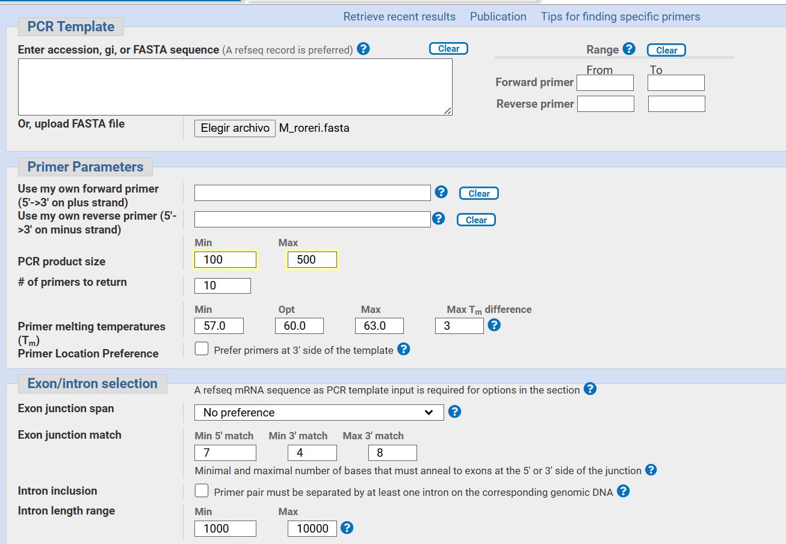{width="525"}

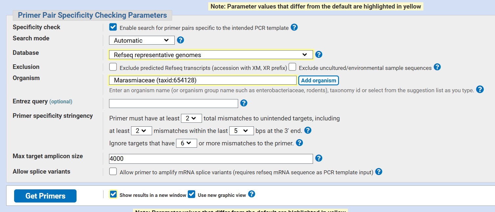{width="521"}

***Moniliophthora perniciosa***

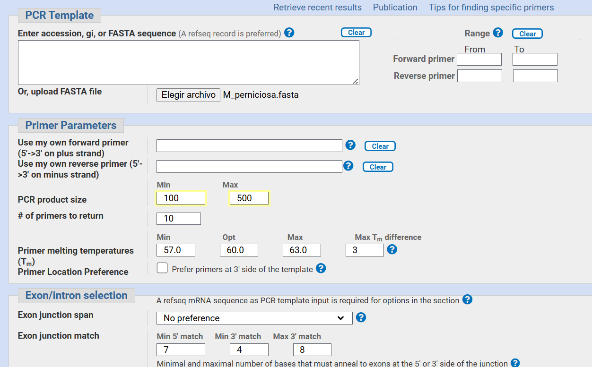{width="515"}

{width="511"}

**Resultados**

Luego de dar click en “Get Primers”, evaluar las opciones.

***Monilioptora roreri***

| **Forward primer** | TCTTCTTAGGGGCATGTGCT |
|:-------------------|----------------------|

| **Reverse primer** | AAAGCCAGCAACCCTCACAT |
|:-------------------|----------------------|

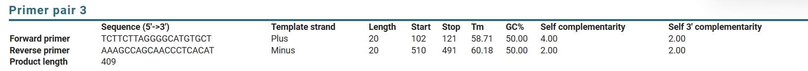

***Moniliophthora perniciosa***

| **Forward primer** | GGCTTTGAACAAGAGTCGGC |
|:-------------------|----------------------|

| **Reverse primer** | TACCCCAGAGAGAGCAGGTC |
|:-------------------|----------------------|

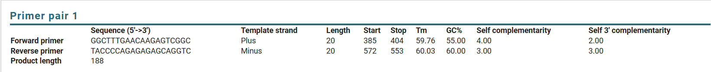

## 4. Verificar sensibilidad y especificidad

Se realizó un script en python para probar que los primers amplificaran donde quería y mediante un slurm se ejecutó.

Los primers diseñados muestran una alta sencibilidad garantizando la amplificación en ambas especies objetivo (*roreri* y *perniciosa*).

**Sensibilidad:**

***M. roreri***

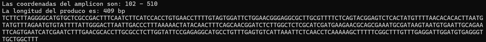

***M. perniciosa***

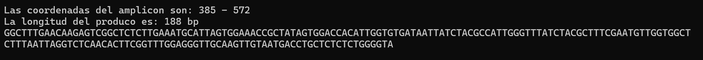

El par de primers diseñado muestra una sensibilidad exitosa para ambas especies, logrando amplificar el fragmento deseado en el clúster ribosomal (ITS). El script de validación en Python confirma que los primers encuentran sus sitios de hibridación en ambas secuencias de referencia:

-   En ***M. perniciosa*** se genera un fragmento de **188 bp**.

-   En ***M. roreri*** se genera un fragmento de **409 bp**.

**Especificidad (Diferenciación):** existe una **diferencia de 221 pares de bases (bp)** entre los productos.

***M. roreri***

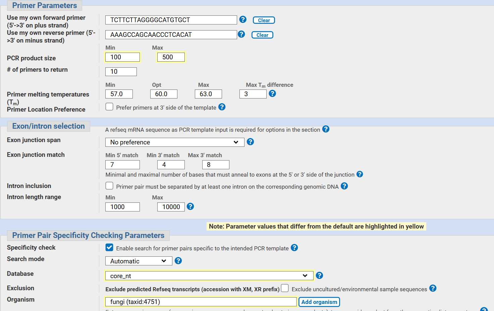{width="539"}

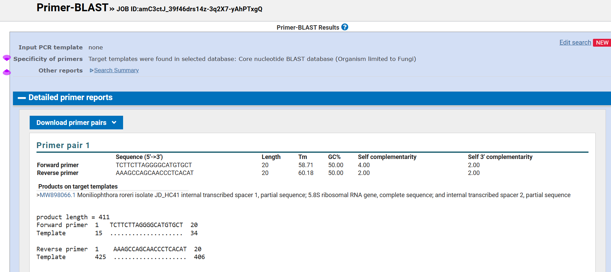{width="488"}

***M. perniciosa***

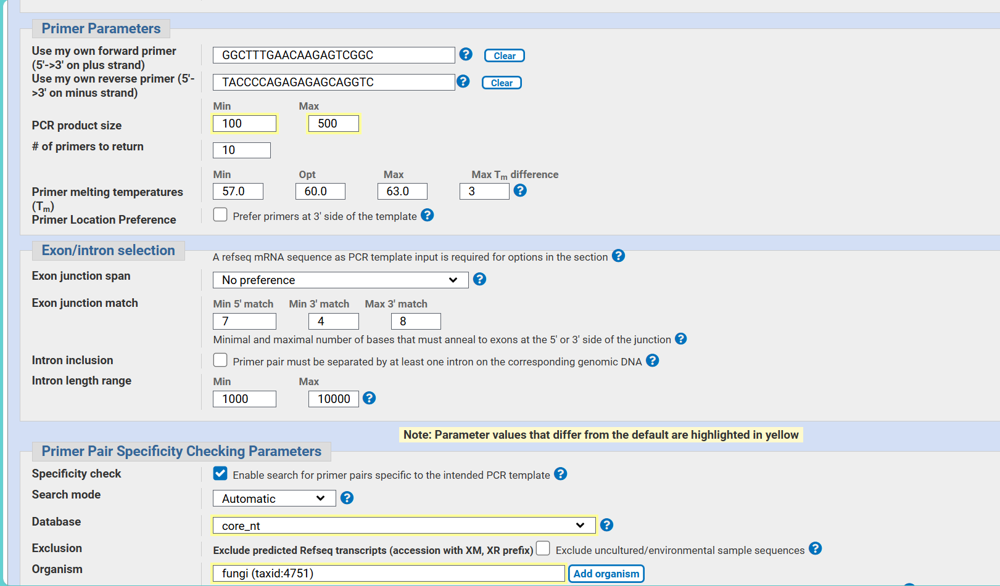{width="492"}

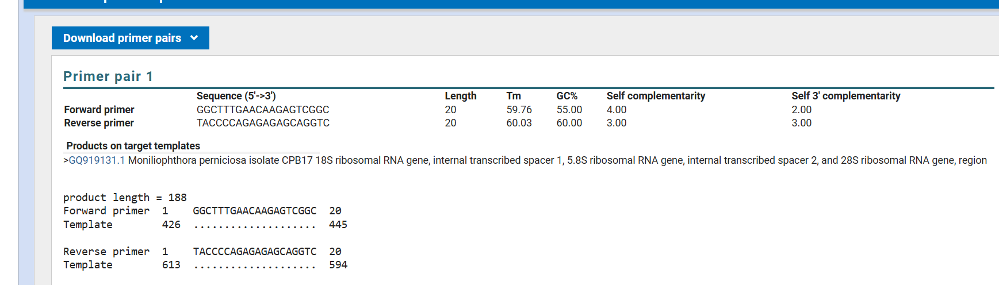{width="468"}

Los resultados anteriores muestran que los primers diseñados para cada especie son especificos de *M. roreri y M. perniciosa*, ya que al ser evaluados en Blast contra todo el reino fungi cada par de primers solo tuvo coincidencia con la especie para la que fue diseñado.

-   **Diferenciación:** La especificidad es discriminatoria entre las dos especies hermanas debido a la gran diferencia en el tamaño del producto (una diferencia de 221 bp), lo que permite identificarlas inequívocamente ena electroforesis convencional.

-   **Ausencia de Off-targets:** Según la verificación en Primer-BLAST, los primers son específicos para el género *Moniliophthora* y no presentan hibridaciones inespecíficas con el genoma de otros patógenos comunes, lo que asegura que no habrá falsos positivos.

**Conclusión**

Los dos pares de primers diseñados representan una herramienta biotecnológica confiable para el diagnóstico diferencial de enfermedades en cacao causada por los hongos *M. roreri y M. perniciosa*. La sensibilidad del ensayo es máxima para el género *Moniliophthora*, garantizando la detección de los patógenos. Además, la especificidad es absoluta frente a otros hongos ambientales, lo que elimina el riesgo de falsos positivos.

Lo interesante de este diseño radica en la capacidad discriminatoria: la brecha de 221 pb entre los productos de amplificación transforma un análisis bioinformático en una prueba de laboratorio sencilla y visual. Mientras que una diferencia pequeña exigiría técnicas costosas, este diseño permite una identificación inequívoca mediante electroforesis convencional, facilitando la toma de decisiones fitosanitarias en el manejo de la Moniliasis y la Escoba de Bruja.
